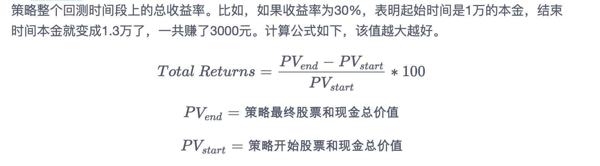
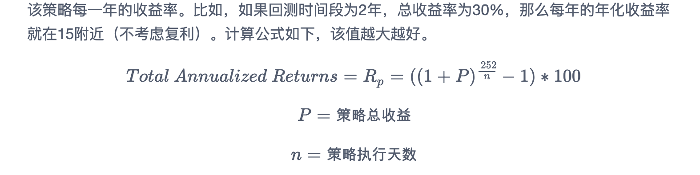
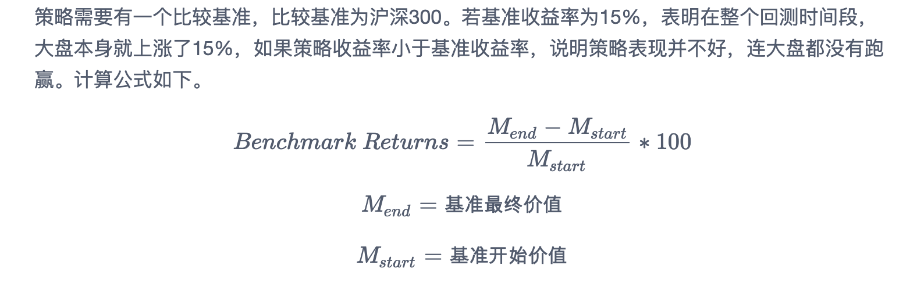
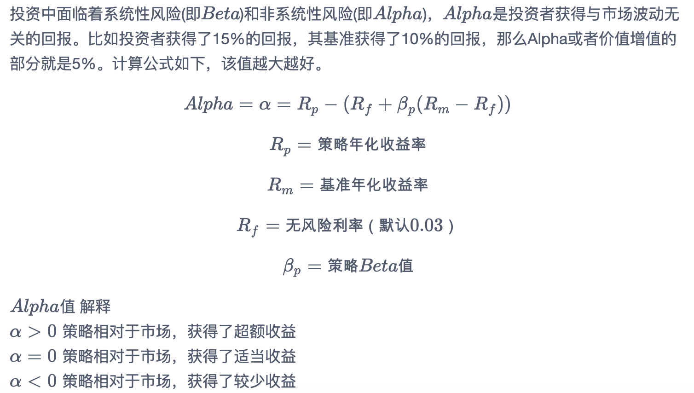
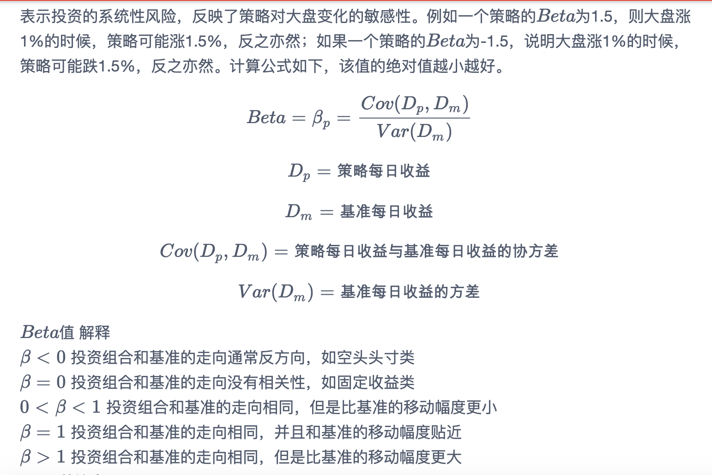
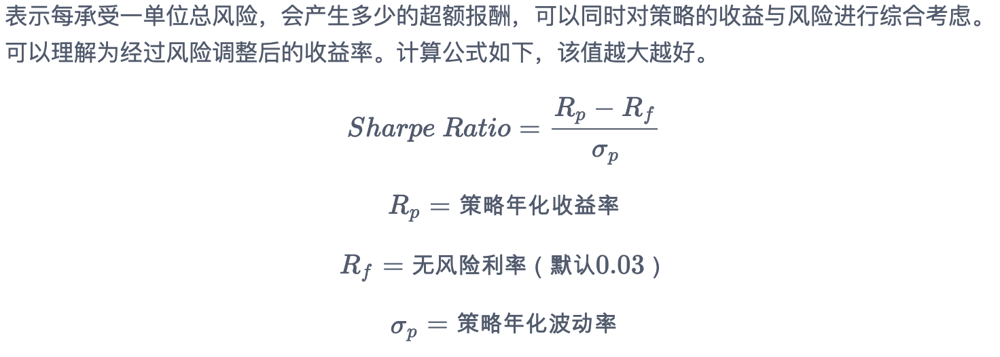
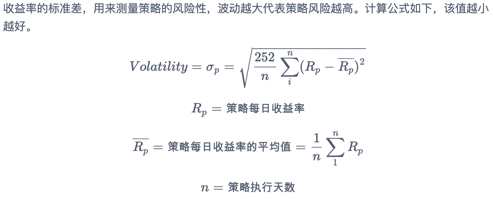
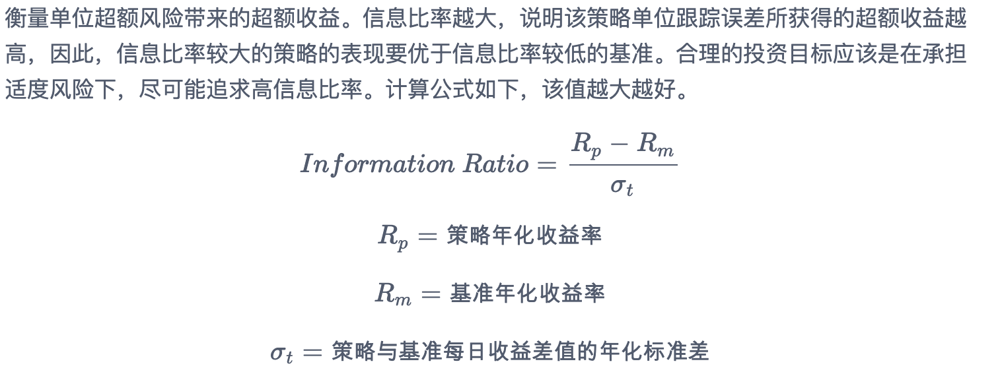

> 导语：当我们策略回测完成时，系统会输出包含各种指标的收益曲线图，但可能因我们对这些指标的释义和内容不太熟悉，导致无法准群判断策略好坏，本文从回测各指标概念入手，希望可以帮助大家更好地理解策略回测结果。

当我们完成一个策略回测时，会得到如下图形，包含 收益概况 、 交易详情 、 每日持仓和收益 、 输出日志 。接下来，我们详细介绍这几个部分。

## 一、收益概况

收益概况以曲线图的方式显示了策略在时间序列上的收益率。

红色曲线为**策略收益率**，蓝色为**基准收益率**(默认的基准设置是沪深300指数)。

绿色曲线为**持仓占比**，10%的持仓占比表示账户里股票市值占账户总资产的10%。

可通过缩放、拖动下方时间轴控件或在右上角填入起止时间来查看不同时间段的曲线走势。

不仅如此，衡量一个策略好坏的关键指标在收益概况页面也充分展示出来了。各指标含义如下：

### 收益率： Total Returns

策略整个回测时间段上的总收益率。比如，如果收益率为30%，表明起始时间是1万的本金，结束时间本金就变成1.3万了，一共赚了3000元。计算公式如下，该值越大越好。

### 年化收益率： Total Annualized Returns

该策略每一年的收益率。比如，如果回测时间段为2年，总收益率为30%，那么每年的年化收益率就在15附近（不考虑复利）。计算公式如下，该值越大越好。

### 基准收益率：Benchmark Returns

策略需要有一个比较基准，比较基准为沪深300。

若基准收益率为15%，表明在整个回测时间段，大盘本身就上涨了15%，如果策略收益率小于基准收益率，说明策略表现并不好，连大盘都没有跑赢。

计算公式如下。

### 阿尔法 Alpha

投资中面临着系统性风险(即Beta)和非系统性风险(即Alpha)，Alpha是投资者获得与市场波动无关的回报。比如投资者获得了15%的回报，其基准获得了10%的回报，那么Alpha或者价值增值的部分就是5%。计算公式如下，该值越大越好。

### 贝塔 Beta

表示投资的系统性风险，反映了策略对大盘变化的敏感性。例如一个策略的Beta为1.5，则大盘涨1%的时候，策略可能涨1.5%，反之亦然；如果一个策略的Beta为-1.5，说明大盘涨1%的时候，策略可能跌1.5%，反之亦然。计算公式如下，该值的绝对值越小越好。

### 夏普比率

表示每承受一单位总风险，会产生多少的超额报酬，可以同时对策略的收益与风险进行综合考虑。可以理解为经过风险调整后的收益率。计算公式如下，该值越大越好。

### 胜率： Winning Percentage

衡量策略盈利一指标。比如10次投资中有8次获利，胜率就是80%。计算公式如下，该值越大越好。

### 盈亏比： The profit and coss ratio

盈亏比是在投资市场里每次交易的盈利和亏损的比例。计算公式如下，该值越大越好

### 收益波动率： Volatility

收益率的标准差，用来测量策略的风险性，波动越大代表策略风险越高。计算公式如下，该值越小越好。

### 信息比率： Information Ratio

衡量单位超额风险带来的超额收益。信息比率越大，说明该策略单位跟踪误差所获得的超额收益越高，因此，信息比率较大的策略的表现要优于信息比率较低的基准。合理的投资目标应该是在承担适度风险下，尽可能追求高信息比率。计算公式如下，该值越大越好。

### 最大回撤： Max Drawdown

策略在整个时间段上亏损最严重的时候相比净值最高值下跌的百分比。如果最大回撤为20%，表明策略在某个时间点上，相比之前的净值最高。计算公式如下，该值越小越好。

## 二、交易详情

交易详情主要显示了策略在整个回测过程中每个交易日的买卖信息。包括买卖时间、股票代码、交易方向、交易数量、成交价格、交易成本。具体见下图：

可以通过右下角的下载交易详情按钮下载数据到本地进行查看。

## 三、每日持仓及收益

每日持仓及收益主要呈现每日持有股票代码、当日收盘价、持仓股票数量、持仓金额、收益等指标。具体见下图：

可以通过右下角的下载持仓详情按钮下载数据到本地进行查看。

需要注意的是这个表中的收益是指每只股票按当日收盘价结算的浮动收益，而不是该只股票真实卖出后的收益，因为卖出后的股票就不在持仓列表中了。策略总收益并不等于此列数据的总和！

## 四、输出日志

输出日志主要为策略运行过程中的一些日志。包括涨跌停股票不能交易、停牌估计不能交易等。该日志可以便于我们检查回测结果的正确性。

如图所示展示了每笔订单的执行时间和具体标的代码，以及订单的成交状态。

至此，您已能初步判断判断策略效果好坏。但回测结果是否可靠？是否按照股票得分排序买入？交易参数是否真实？有无偷价漏价情形？此类情况均可参考下方高阶教程进行校验。
